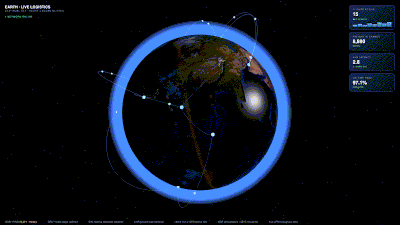

# Earth · Live Logistics Globe

A single-file Three.js dashboard: a realistically textured, spinning, 23.4°-tilted planet Earth
with a world-space day/night terminator, topographic relief, ocean sun-glitter, glowing
great-circle flight arcs, and a glassmorphic live-data HUD.

- **Source:** <https://github.com/frankhouston/earth-logistics-globe>
- **Live (GitHub Pages):** <https://frankhouston.github.io/earth-logistics-globe/>



```
├── index.html   <- the entire project lives in this one self-contained file
├── .gitignore
└── README.md
```

## Run locally

Double-click `index.html` (or `open index.html`). No build step, no server. Needs a
WebGL-capable browser (Chrome / Edge / Safari / Firefox).

On first open it loads Three.js + the Earth textures from a CDN, so it wants an internet
connection. Fully offline it **still renders — no black screen**: the globe falls back to a
flat ocean-blue color with the terminator / tilt / spin / arcs / HUD all intact, minus the
photographic continents.

## Features

- **Planet Earth** — Blue-Marble day + night city-lights + topographic-relief textures (from the
  `three-globe` package via jsdelivr/unpkg, with a source-ladder + flat-color fallback).
  Equirectangular UVs are computed from local sphere coords so continents are right-side-up and
  spin with the planet.
- **World-space day/night terminator** — the sun line stays fixed in the world while the planet
  spins, so the continents sweep through it. The 23.4° axial tilt gives seasonal pole lighting.
- **Topographic relief** — the world-space surface normal is perturbed by the terrain elevation
  gradient, so mountains catch the sun and shade at the limb.
- **Ocean sun-glitter** — a tight specular highlight on the water, gated by a blue-dominant ocean
  mask so it lands on seas, not land/ice/desert.
- **Atmosphere + stars** — additive back-side glow shell; ~1800 far-field stars.
- **Flight network** — 14 glowing great-circle arcs over 10 real hubs (JFK, LAX, LHR, FRA, DXB,
  HKG, SIN, NRT, SYD, GRU), with packets flowing along each arc.
- **Glassmorphic live HUD** — backdrop-blur stat cards (flights active, freight in transit, avg
  latency, on-time rate) + a route ticker, numbers driven from the running network (~8 fps).
- **Controls** — orbit (drag), zoom (scroll, clamped 2.6–9). The planet's own tilt-spin + the
  orbiting sun provide the auto-demo (the first frame is already alive).

## Robustness contract

Built to a hard "never render a silent black canvas" contract:

- Everything is self-lit (ShaderMaterial / MeshBasicMaterial / additive). No scene lights that a
  face can turn away from.
- Geometry is purely procedural (no `.gltf`/`.obj`); textures load from CORS CDNs with a source
  ladder and a flat-color fallback if every source fails.
- An on-screen red error trap (whole module wrapped in `try/catch`) shows the failure text —
  including GLSL compile/link errors — instead of a black screen.

## Distribution

`index.html` *is* the project. To produce a portable zip on demand:

```
zip -j earth-logistics-globe.zip index.html
```
